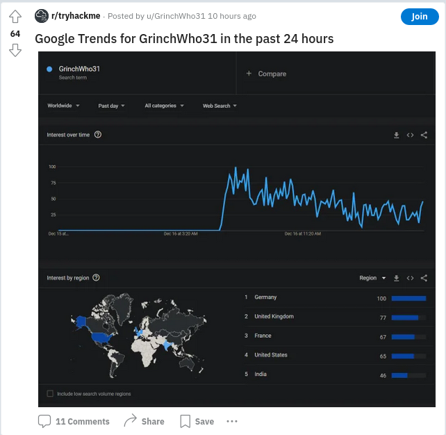
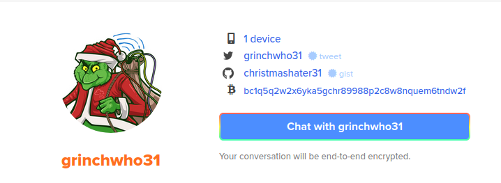
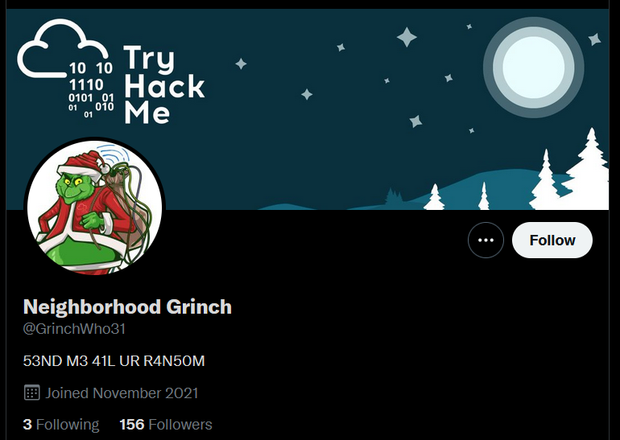
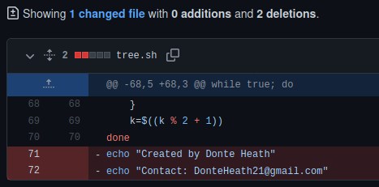

The happy festival company has some ransomware issues, and there's a note that reads: 

```code
!!! ВАЖНЫЙ !!!

Ваши файлы были зашифрованы Гринчем. Мы используем самые современные технологии шифрования.

Чтобы получить доступ к своим файлам, обратитесь к оператору Grinch Enterprises.

Ваш личный идентификационный идентификатор: «b288b97e-665d-4105-a3b2-666da90db14b».

С оператором, назначенным для вашего дела, можно связаться как "GrinchWho31" на всех платформах.

!!! ВАЖНЫЙ !!!
```

when put into google translate, it says: 

```code
!!! IMPORTANT !!! Your files were encrypted by the Grinch. We use the most advanced encryption technology. Contact your Grinch Enterprises operator to access your files. Your personal ID is “b288b97e-665d-4105-a3b2-666da90db14b”. The operator assigned to your case can be contacted as "GrinchWho31" on all platforms. !!! IMPORTANT !!!
```

We can't do much with the personal ID, but the contactperson should be possible to find out more information about. 

one favourite tool for this is sherlock: 
```shell
sudo apt install -y sherlock

┌──(kryssar㉿kali)-[/mnt/hgfs/VMSHARED/tryhackme]
└─$ sherlock GrinchWho31     
[*] Checking username GrinchWho31 on:
[+] CapFriendly: https://www.capfriendly.com/users/GrinchWho31
[+] Coil: https://coil.com/u/GrinchWho31
[+] Facenama: https://facenama.com/GrinchWho31
[+] Fiverr: https://www.fiverr.com/GrinchWho31
[+] Keybase: https://keybase.io/GrinchWho31
[+] Reddit: https://www.reddit.com/user/GrinchWho31
[+] Tinder: https://www.gotinder.com/@GrinchWho31
[+] Twitter: https://twitter.com/GrinchWho31
```

there's some false positives but on `reddit` he popped up: 
`https://www.reddit.com/user/GrinchWho31`



and `keybase`
`https://keybase.io/GrinchWho31`



and `twitter`
`https://mobile.twitter.com/GrinchWho31`



where `twitter` is the answer for the social media platform we're after.

cryptographic identifier for the operator: `1GW8QR7CWW3cpvVPGMCF5tZz4j96ncEgrVaR` which stands on the twitter page.

platform for the crypto-identifier: `keybase.io`

bitcoin address: `bc1q5q2w2x6yka5gchr89988p2c8w8nquem6tndw2f`
presented on the keybase.io page.

the bitcoin address can also be found on github: 
`https://github.com/ChristmasHater31/Christmas-Stealer/blob/main/ransom.cpp`

in the previous commits on github, more information can be found:  
`https://github.com/ChristmasHater31/ChristBASHTree/commit/e7c8970160c38e8a7a598a7fefcb617544c117b6`



Operator's personal email: `DonteHeath21@gmail.com`

Operators real name: `Donte Heath`

EOF 